<!-- vscode-markdown-toc -->
* 1. [新建项目](#新建项目)
* 2. [前期准备](#前期准备)
    * 2.1. [资源视图](#资源视图)
* 3. [添加菜单栏和对话框](#添加菜单栏和对话框)
    * 3.1. [添加菜单栏](#添加菜单栏)
    * 3.2. [添加对话框](#添加对话框)
* 4. [实现点击菜单栏按钮呼出窗口](#实现点击菜单栏按钮呼出窗口)
* 5. [实现数据库连接并在窗口中显示](#实现数据库连接并在窗口中显示)
* 6. [实现添加操作](#实现添加操作)
* 7. [实现选取列表中某行并显示在底下](#实现选取列表中某行并显示在底下)
* 8. [实现删除操作](#实现删除操作)
* 9. [实现修改操作](#实现修改操作)
* 10. [问题1：连接数据库失败](#问题1：连接数据库失败)
    * 10.1. [解决方案](#解决方案)
* 11. [问题2：未定义标识符_ConnectionPtr adodbConnection;等](#问题2：未定义标识符_connectionptr-adodbconnection;等)
    * 11.1. [解决方案](#解决方案-1)

<!-- vscode-markdown-toc-config
	numbering=true
	autoSave=true
	/vscode-markdown-toc-config -->
<!-- /vscode-markdown-toc -->
# Adodb
---
##  1. 新建项目
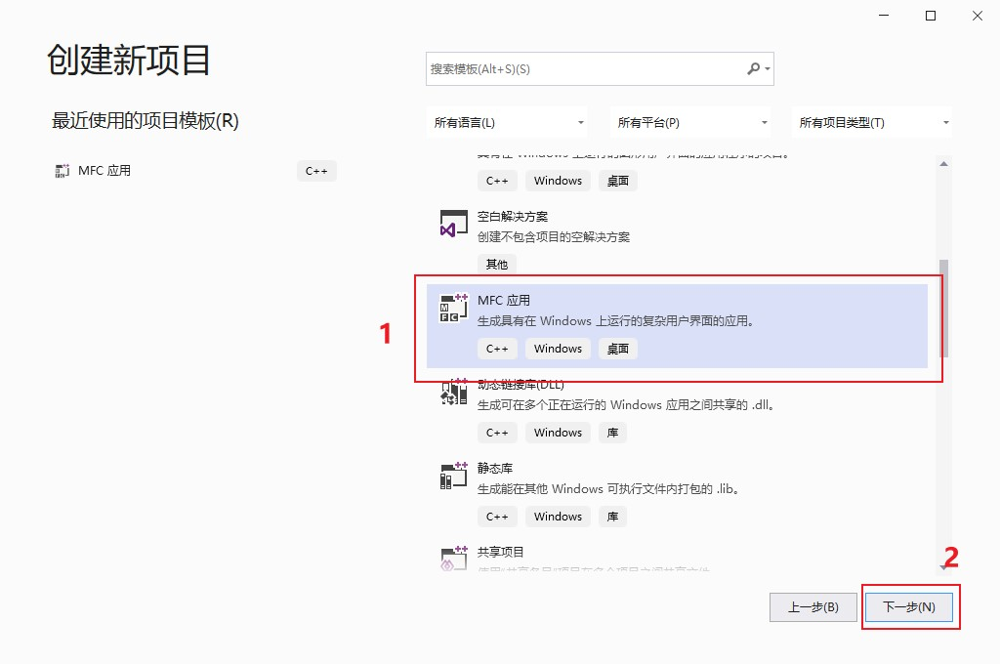
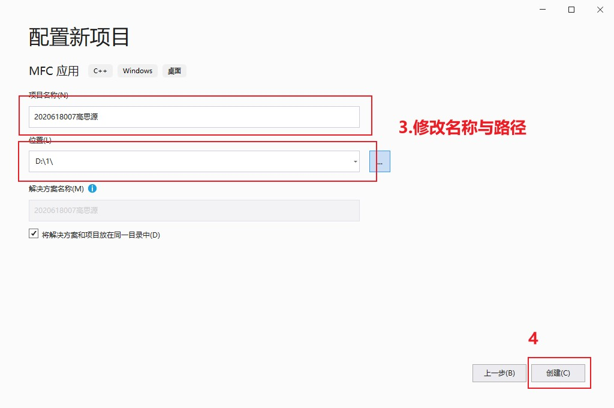
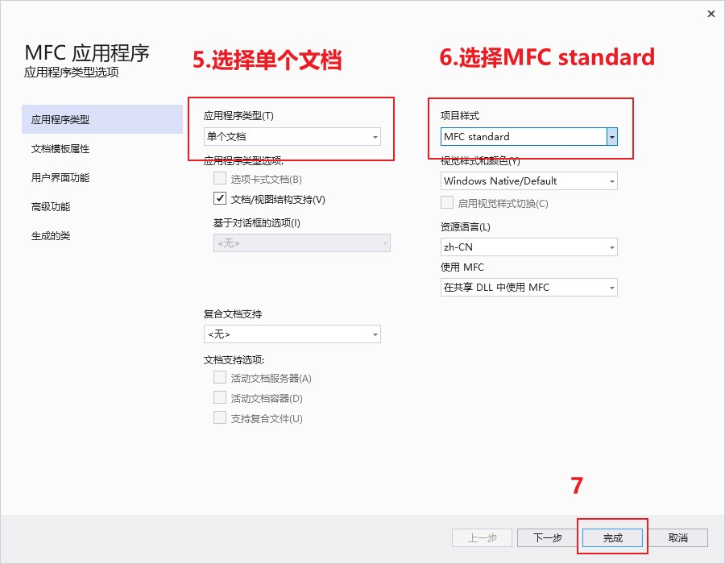

---
##  2. 前期准备
###  2.1. 资源视图
要进行可视化对话框编辑需打开如下资源视图

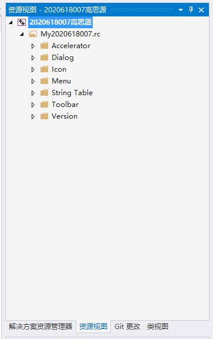

打开方式如下图

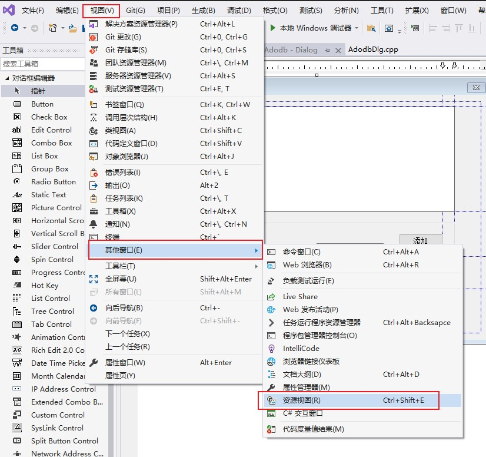

---
##  3. 添加菜单栏和对话框
###  3.1. 添加菜单栏
在资源视图中双击IDR_MAINFRAME

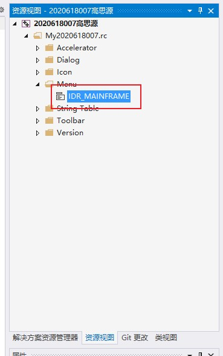

在帮助后空白处右键，并点击新插入

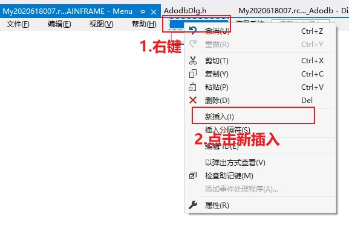

双击新插入的空白处，添加标题

或者在右下角的属性中的描述文字后添加标题

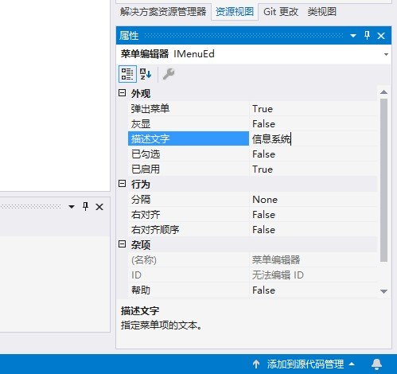

在刚才添加完的菜单底下进行同样的操作，插入并修改名称

在属性中最好改一下ID，方便之后操作

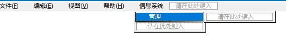

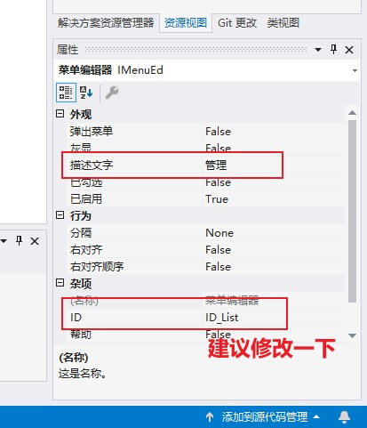

###  3.2. 添加对话框
在资源视图的Dialog上右键并点击插入Dialog

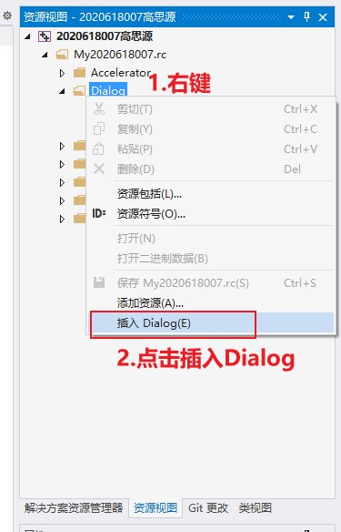

在右下角修改，叫啥自己定

描述文字里的内容是显示在对话框的左上角

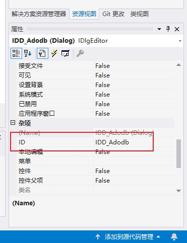

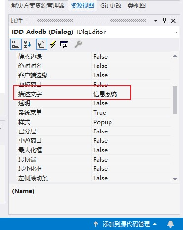

添加所需要的控件

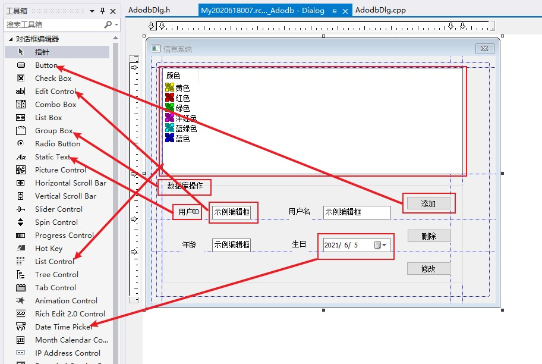

编辑框和按钮最好改一下ID，方便之后操作

注：列表控件的属性中还需改一下视图才会变成图中的那种效果

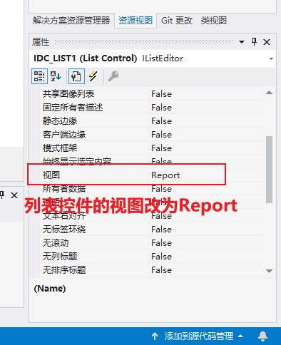

---
##  4. 实现点击菜单栏按钮呼出窗口
回到资源视图的Menu中的IDR_MAINFRAME

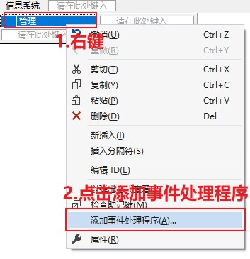

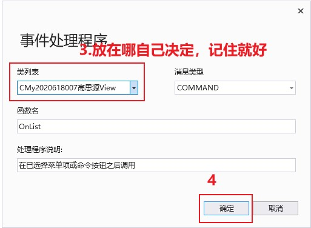

转到资源视图的Dialog中刚刚创建的对话框

右键空白处，点击添加类

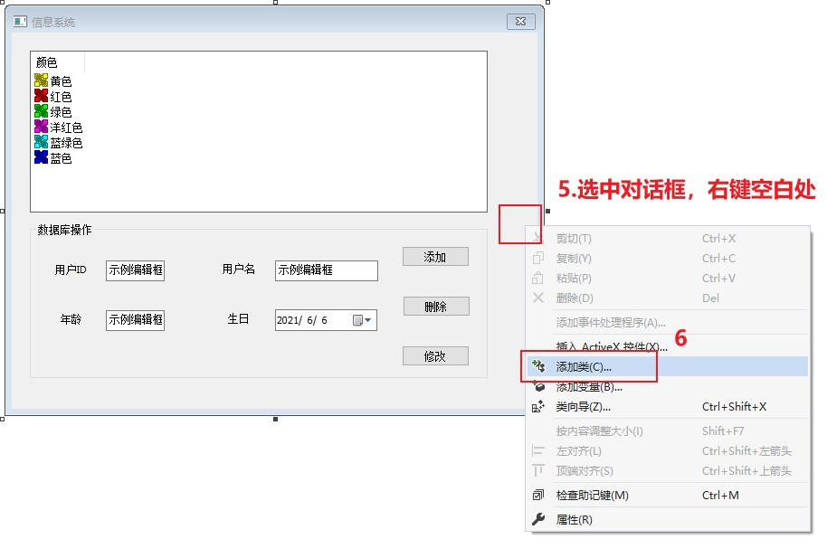

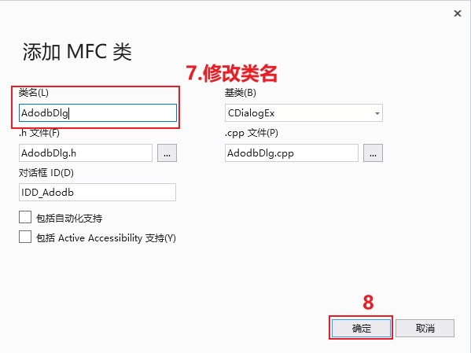

跳转至刚才添加事件处理程序时选择的类列表文件

在OnList中添加代码

    AdodbDlg dlg;  
    dlg.DoModal();

在开头添加头文件

    #include "AdodbDlg.h"

注：将两段代码中的AdodbDlg改为刚才自己添加的类的名称

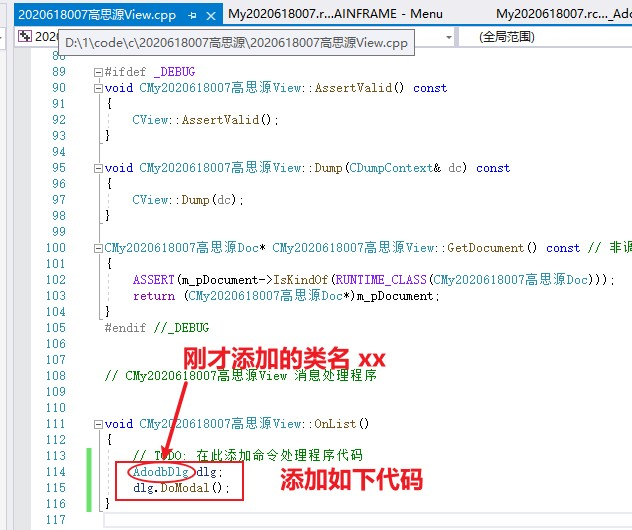

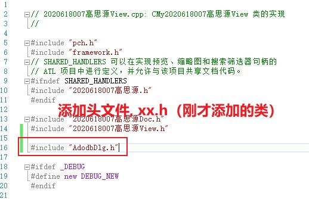

---
##  5. 实现数据库连接并在窗口中显示
将森哥的这个测试文件放到资源文件中

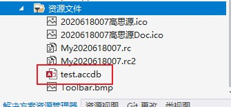

回到刚才创建的Dialog

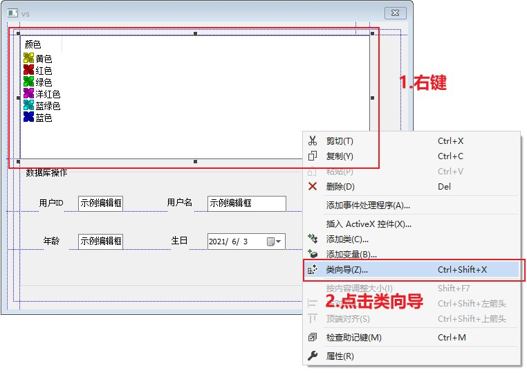

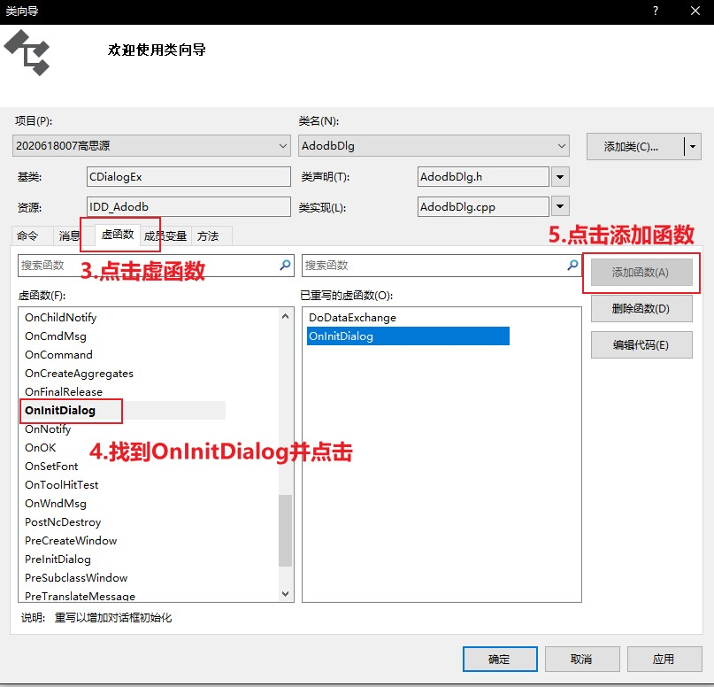

操作完后发现xx.cpp中多了个函数

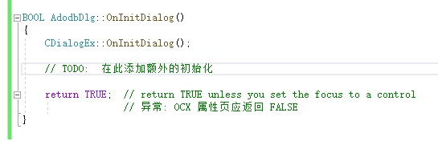

然后添加变量

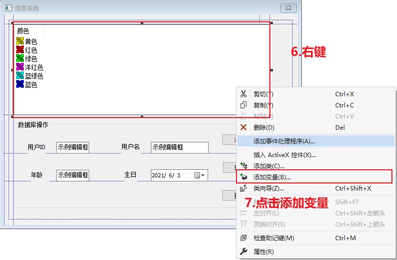
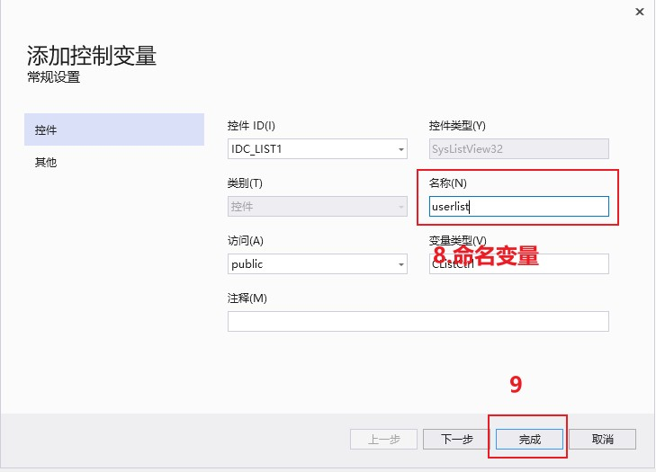

在framework.h中添加以下代码

    #import "C:\Program Files\Common Files\System\ado\msado15.dll"   rename("EOF", "adoEOF") using namespace ADODB; 
       		
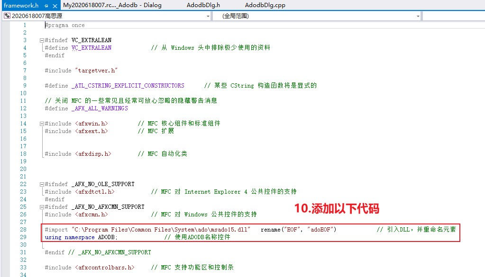

在头文件xx.h中添加以下代码(创建数据库连接、操作对象和变量)

    _ConnectionPtr adodbConnection;
    _RecordsetPtr adodbRecordset;
    _variant_t vUsername, vBirthday, vID, vOld;

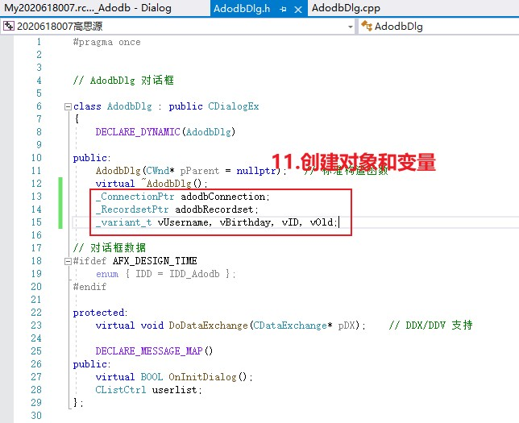

回到xx.cpp中

在OnInitDialog()中添加以下代码

    ::SendMessage(userlist.m_hWnd, LVM_SETEXTENDEDLISTVIEWSTYLE, LVS_EX_FULLROWSELECT, LVS_EX_FULLROWSELECT); //高亮
	//////////为列表控件添加列//////////
	userlist.InsertColumn(0, _T("用户ID"), LVCFMT_LEFT, 60);
	userlist.InsertColumn(1, _T("用户名"), LVCFMT_LEFT, 100);
	userlist.InsertColumn(2, _T("年龄"), LVCFMT_LEFT, 60);
	userlist.InsertColumn(3, _T("生日"), LVCFMT_LEFT, 130);

	HRESULT hr;
	try
	{
		hr = adodbConnection.CreateInstance(_T("ADODB.Connection"));///创建Connection对象
		if (SUCCEEDED(hr))
		{
			hr = adodbConnection->Open("Provider=Microsoft.ACE.OLEDB.12.0;Data Source=test.accdb", "", "", adModeUnknown);///连接数据库
		}
	}
	catch (_com_error e)///捕捉异常
	{
		CString errormessage;
		errormessage.Format(_T("连接数据库失败!\r\n错误信息:%s"), e.ErrorMessage());
		AfxMessageBox(errormessage);///显示错误信息
		return FALSE;
	}
	RefreshData();

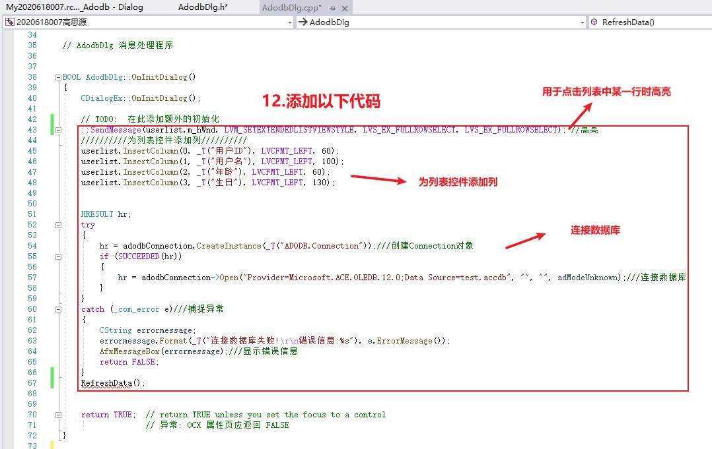

添加函数RefreshData()

方便点的方法：在类视图右键名为xx的类，点击添加函数

笨点的方法：在xx.h添加函数定义，然后在xx.cpp添加函数

    void AdodbDlg::RefreshData()
    {
        int i = 0;
        userlist.DeleteAllItems();
        try
        {
            adodbRecordset.CreateInstance("ADODB.Recordset");
            adodbRecordset->Open("SELECT * FROM users", _variant_t((IDispatch*)adodbConnection, true), adOpenStatic, adLockOptimistic, adCmdText);
            //m_bSuccess = TRUE;
            while (!adodbRecordset->adoEOF)
            {
                vID = adodbRecordset->GetCollect("ID");
                vUsername = adodbRecordset->GetCollect("username");
                vOld = adodbRecordset->GetCollect("old");
                vBirthday = adodbRecordset->GetCollect("birthday");
                userlist.InsertItem(i, (_bstr_t)vID);
                userlist.SetItemText(i, 1, (_bstr_t)vUsername);
                userlist.SetItemText(i, 2, (_bstr_t)vOld);
                userlist.SetItemText(i, 3, (_bstr_t)vBirthday);

                adodbRecordset->MoveNext();
                i++;
            }
        }
        catch (_com_error e)///捕捉异常
        {
            MessageBox(_T("读取数据库失败!"));///显示错误信息
        }
    }

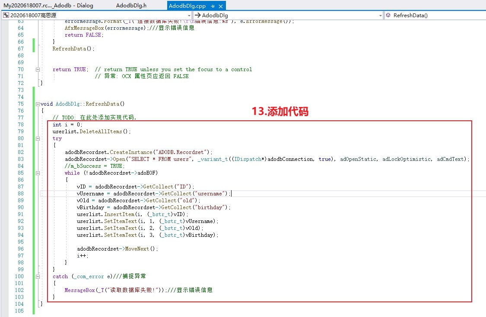

调试成功！

调试有问题，详见底下问题1和2

[问题1：连接数据库失败](#问题1：连接数据库失败)

[问题2：未定义标识符_ConnectionPtr adodbConnection;等](#问题2：未定义标识符_connectionptr-adodbconnection;等)

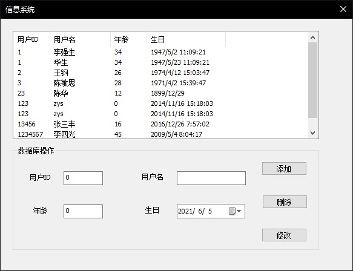

---
##  6. 实现添加操作
转到dialog文件

添加变量，4个编辑框都要(以下只演示一个)

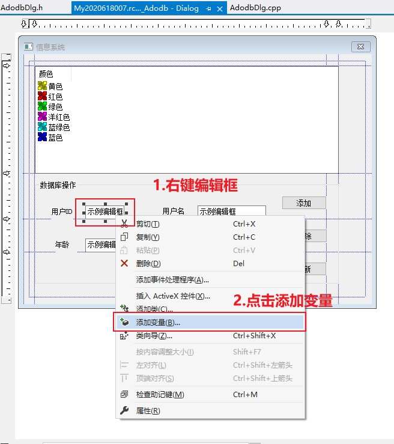
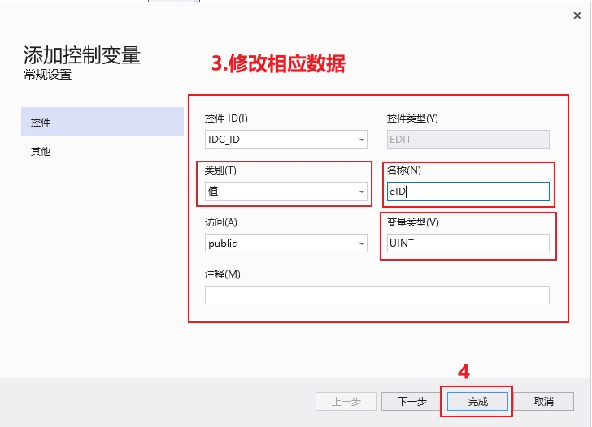

在类向导中操作也行，类向导中能查看也能添加

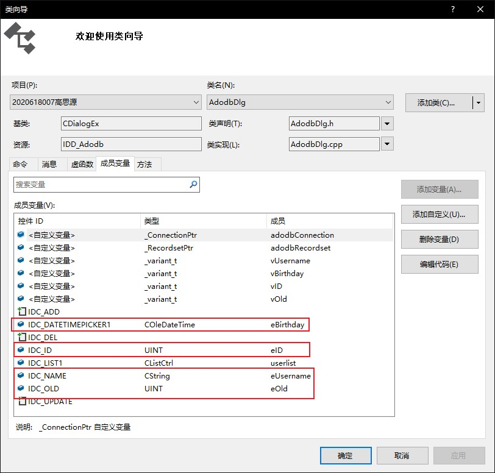

然后

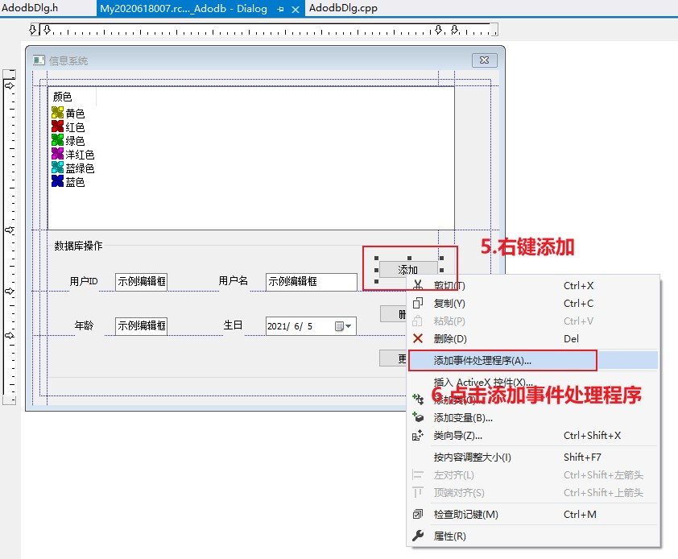
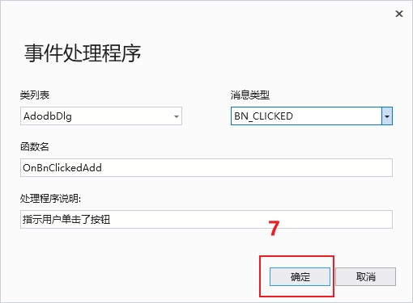

转到xx.cpp

在OnBnClickedAdd()中添加以下代码

    SaveData();
    
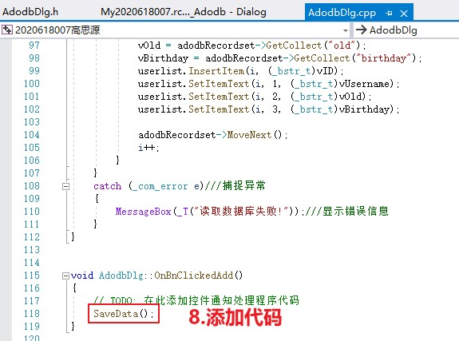

跟之前一样添加函数SaveData()，并添加以下代码

    if (UpdateData())
    if (eUsername.GetLength() > 0)
    {
        adodbRecordset->AddNew();
        if (!adodbRecordset->adoEOF)
        {
            vID = (long)eID;
            vUsername = eUsername;
            vOld = (long)eOld;
            vBirthday = eBirthday;
            adodbRecordset->PutCollect("ID", vID);
            adodbRecordset->PutCollect("username", vUsername);
            adodbRecordset->PutCollect("old", vOld);
            adodbRecordset->PutCollect("birthday", vBirthday);
            adodbRecordset->Update();
            RefreshData();
        }
    }

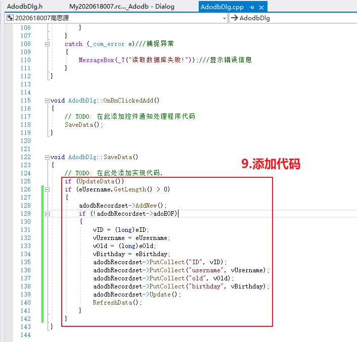

调试发现成功

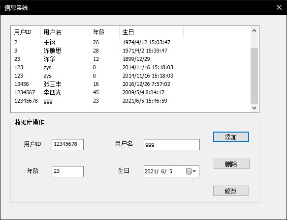

---
##  7. 实现选取列表中某行并显示在底下
转到dialog文件

与之前添加操作类似，右键列表控件，点击事件处理程序，将消息类型改为NM_CLICK

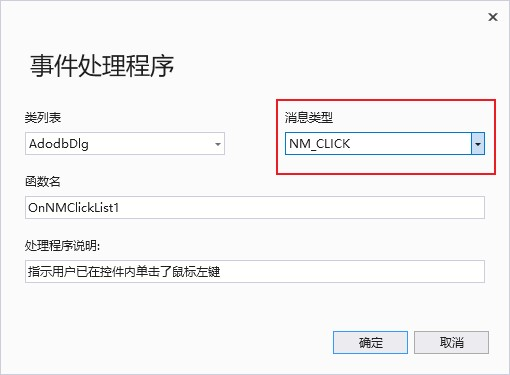

转到xx.cpp

在OnNMClickList1()中添加以下代码

    int m_nCurrentSel = userlist.GetSelectionMark();
	adodbRecordset->Move(m_nCurrentSel, _variant_t((long)adBookmarkFirst));
	vID = adodbRecordset->GetCollect("ID");
	vUsername = adodbRecordset->GetCollect("username");
	vOld = adodbRecordset->GetCollect("old");
	vBirthday = adodbRecordset->GetCollect("birthday");
	eID = vID.lVal;
	eUsername = (LPCTSTR)(_bstr_t)vUsername;
	eOld = vOld.lVal;
	eBirthday = vBirthday;
	UpdateData(FALSE);
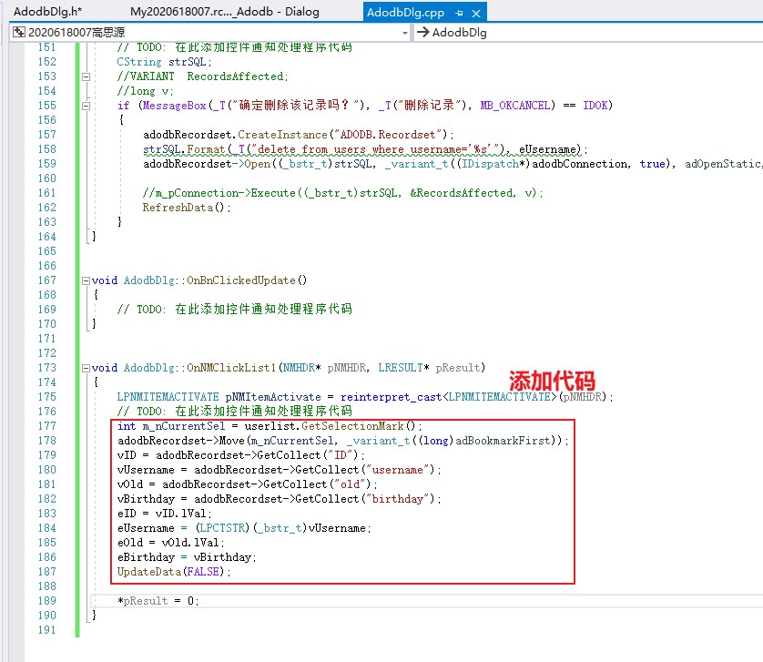

调试发现成功

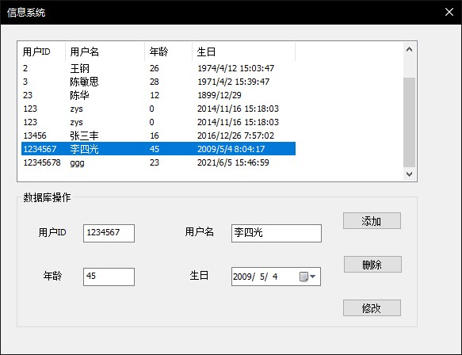

---
##  8. 实现删除操作
转到dialog文件

与之前添加操作类似，右键删除按钮，点击事件处理程序，然后确定

转到xx.cpp

在OnBnClickedDel()中添加以下代码

    CString strSQL;
	if (MessageBox(_T("确定删除该记录吗？"), _T("删除记录"), MB_OKCANCEL) == IDOK)
	{
		adodbRecordset.CreateInstance("ADODB.Recordset");
		strSQL.Format(_T("delete from users where username='%s'"), eUsername);
		adodbRecordset->Open((_bstr_t)strSQL, _variant_t((IDispatch*)adodbConnection, true), adOpenStatic, adLockOptimistic, adCmdText);

		RefreshData();
	}

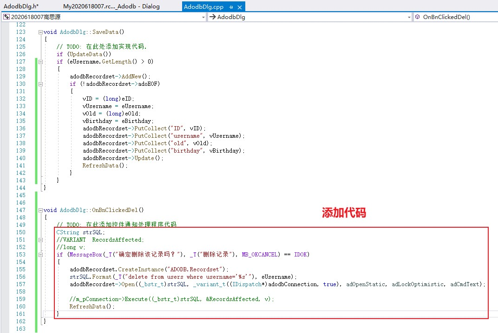

调试发现成功

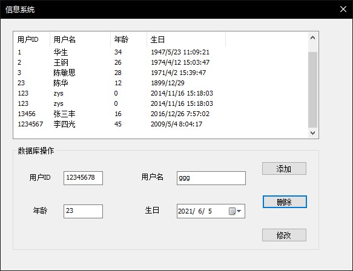

---
##  9. 实现修改操作
转到dialog文件

与之前添加操作类似，右键修改按钮，点击事件处理程序，然后确定

转到xx.cpp

在OnBnClickedUpdate()中添加以下代码

    int m_nCurrentSel = -1;
	m_nCurrentSel = userlist.GetSelectionMark();
	if (m_nCurrentSel >= 0)
	{
		try
		{

			adodbRecordset->MoveFirst();
			adodbRecordset->Move(long(m_nCurrentSel));
			if (MessageBox(_T("确定修改该记录吗？"), _T("修改记录"), MB_OKCANCEL) == IDOK)
			{
				adodbRecordset->Delete(adAffectCurrent);
				SaveData();
			}

		}
		catch (_com_error e)///捕捉异常
		{
			MessageBox(_T("读取数据库失败!"));///显示错误信息
		}

	}
	else
		MessageBox(_T("请在列表控件中选择要修改的记录"));

调试发现成功

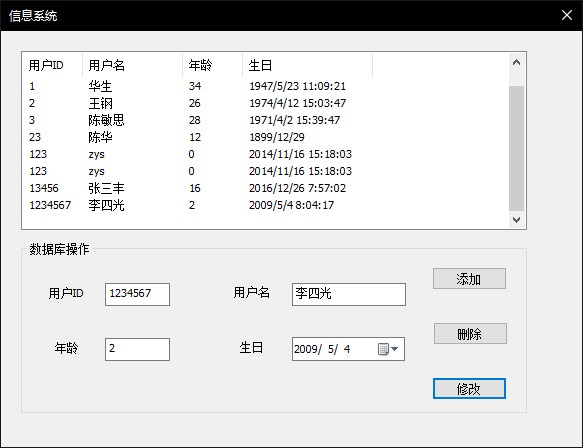

---
##  10. 问题1：连接数据库失败
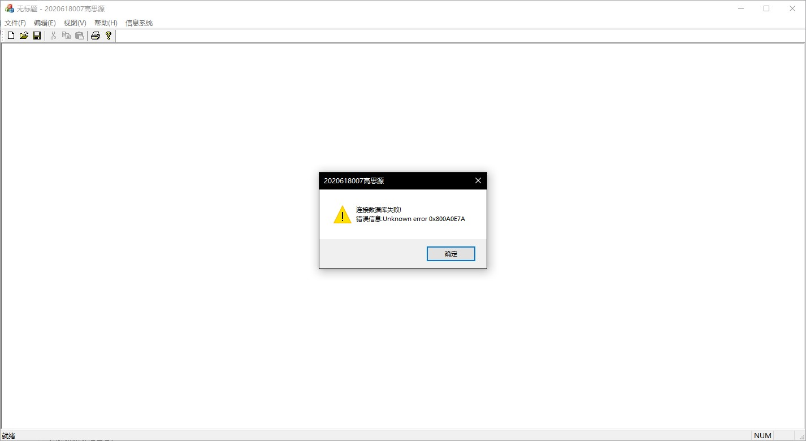
###  10.1. 解决方案
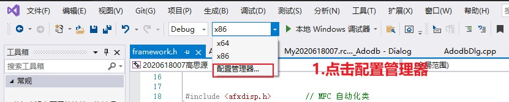
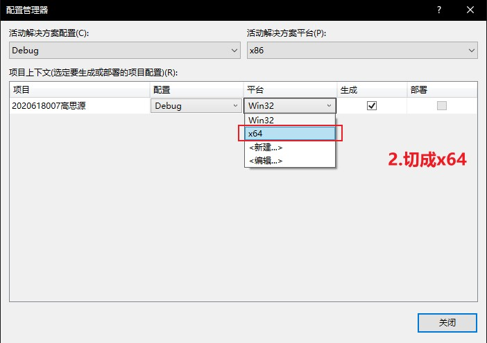

---
##  11. 问题2：未定义标识符_ConnectionPtr adodbConnection;等
###  11.1. 解决方案
尝试将framework.h中添加的代码换个位置

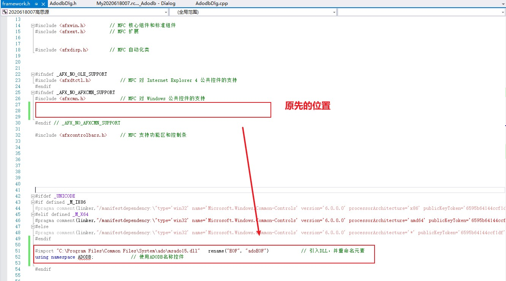

