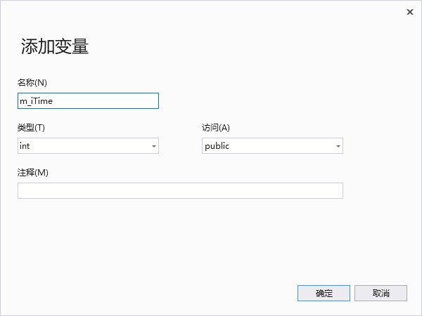
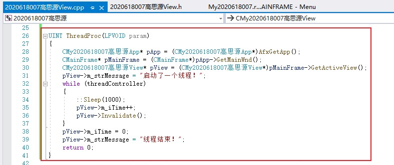

# Thread
---
##  用全局变量实现线程创建与终止
回到资源视图中Menu，打开IDR_MAINFRAME

跟之前一样先创建菜单栏，分别更改ID

然后分别右键，添加事件处理程序，在类列表中选择类(以下只演示一个)

回到刚才所选择的类中

在开头添加全局变量threadController

    volatile int threadController;

然后在类视图中右键所选择的类，添加以下变量

转到在所选择的类的头文件中，可以发现变量添加成功

继续回到所选择的类中

在构造函数中添加以下代码

    m_strMessage = "没有线程启动";
	m_iTime = 0;

找到OnDraw()函数中添加以下代码，别忘了把参数中的注释去掉

然后在刚才添加的两个事件处理程序的函数中分别添加以下代码

    threadController = 1;
	HWND hWnd = GetSafeHwnd();
	AfxBeginThread(ThreadProc, hWnd, THREAD_PRIORITY_NORMAL);
    /////////////////////////////////////////////////////
    threadController = 0;

在文件开头添加头文件

    #include "MainFrm.h"

最后再添加一个线程函数

    UINT ThreadProc(LPVOID param)
    {
        CMy2020618007高思源App* pApp = (CMy2020618007高思源App*)AfxGetApp();
	    CMainFrame* pMainFrame = (CMainFrame*)pApp->GetMainWnd();
	    CMy2020618007高思源View* pView = (CMy2020618007高思源View*)pMainFrame->GetActiveView();
        pView->m_strMessage = "启动了一个线程！";
        while (threadController)
        {	
            ::Sleep(1000);
            pView->m_iTime++;
            pView->Invalidate();
        }
        pView->m_iTime = 0;
        pView->m_strMessage = "线程结束！";
        return 0;
    }

调试发现成功

---

